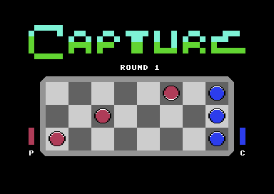

# Capture

A mini puzzle game for Commodore 64 written in 6502 Assembly.

<p align="center">
  
</p>

## Dependencies
- 64tass: 6502 Cross Assembler
- VICE: C64 Emulator

## Compile
```
make
```

## Play
```
make run
```

## Create D64 disk image
```
make d64
```
